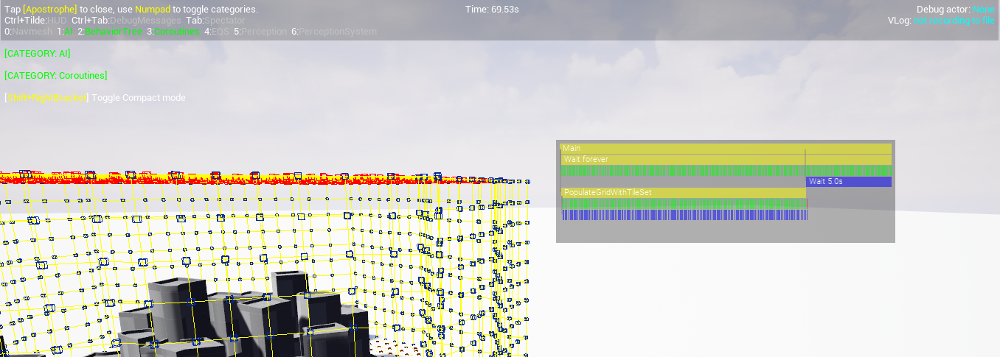

# ACE Team Coroutines Plugin for Unreal Engine
If you're familiar with Unity's coroutines and ever wanted something similar to use with Unreal Engine from C++, this plugin does exactly that, but with a broader feature set.

Compared to Unity's coroutines, this system makes it much simpler to compose coroutines, so one can wait for another, run in parallel or interrupt another.

If you're unfamiliar with coroutines, they are a way to write code in a way that is similar to a function, but it doesn't have to be executed all at once. It can be suspended at certain points and continue its execution in later frames.

The nomenclature and feature set of this plugin was inspired by [**SkookumScript**](https://github.com/EpicSkookumScript/SkookumScript-Plugin) and the use we gave it during development of [**The Eternal Cylinder**](https://www.eternalcylinder.com).

## Alternatives
Be sure to check out other plugins that approach this problem differently. There are a couple of cool ones that make use of C++ 20 coroutine support:
- [SquidTasks](https://github.com/westquote/SquidTasks)
- [UE5Coro](https://github.com/landelare/ue5coro)

Keep in mind that plugins that use C++ 20 coroutines don't run out of the box on UE4 on all platforms without source modifications.
Also at least SquidTasks currently has issues with crashing after using a Live Coding recompile.
ACE Team Coroutines has neither of these issues.

ACE Team Coroutines also has the advantage of having a [visual debugger](#visual-debugger) included, so you can see what is currently running.

## Basic Usage
As with any other C++ module, you need to add the **"ACETeam_Coroutines"** module to the list of dependencies of your module's .Build.cs file

It's recommended that you include the following headers:
- *CoroutineElements.h* to have access to the building blocks for your coroutines.
- *CoroutinesSubsystem.h* for a simple way to run your coroutine. The UCoroutinesSubsystem can execute coroutines in any circumstance. Even in the editor while it's not in play mode.
- *CoroutinesWorldSubsystem.h* to run your coroutine in the context of a specific world. Coroutines executed using this subsystem will only update if that world is not paused.

For simplicity you can add a "using namespace" declaration so you don't have to preface coroutine elements with the ACETeam_Coroutines namespace.

Many of the features of the system are explored in the following code sample:

```c++
...

#include "CoroutineElements.h"
#include "CoroutinesSubsystem.h"

using namespace ACETeam_Coroutines;

...

FCoroutineNodeRef _CoroutineTest(UWorld* World, FString TextToLog)
{
    //Shared ptr values can be used to share data between different execution branches,
    // or different steps in your coroutine
    //This way they're guaranteed to share the same lifetime as the code that's using them
    auto SharedValue = MakeShared<int>(0);
    //_Seq concatenates coroutine elements in a sequence. It runs one after the other until
    // one of them fails
    //If one of them finishes during a frame, the next in the sequence will be evaluated
    // in the same frame
    return _Seq(
        //_Race starts an execution branch for each of its contained elements, in the declared order.
        // Aborts any running branches when one finishes its execution (successfully or unsuccessfully).
        _Race(
            //a _Loop will run its contained element once per frame, until it fails or is aborted
            _Loop(
                //_Weak creates an element that will only evaluate its lambda if the passed in
                // object is valid on evaluation
                _Weak(World, [] { DrawDebugPoint(World, FVector::ZeroVector, 10, FColor::White); })
            ),
            //_LoopSeq is a shortcut for a _Loop containing a _Seq
            _LoopSeq(
                //_Wait will pause this execution branch for the specified time
                _Wait(1.0f),
                [=] {
                    UE_LOG(LogTemp, Log, TEXT("This text will print once per second"));
                    UE_LOG(LogTemp, Log, TEXT("This parameter was captured by value %s"), *TextToLog);
                },
                //mutable lambdas can be used to have local variables that share their lifetime
                [Counter = 0] () mutable {
                    //When this returns false, the containing loop will finish
                    return ++Counter <= 10;
                },
                [=] {
                    //If one execution branch wants to pass data to a different
                    //branch, you can use shared variables
                    *SharedValue += FMath::RandHelper(10);
                }
            )
        ),
        [=] { 
            UE_LOG(LogTemp, Log, TEXT("This log will appear after the race above finishes"));
            UE_LOG(LogTemp, Log, TEXT("The final value stored in SharedValue is  %d"), *SharedValue); 
        }
    );
}

void UTestObject::RunTestCoroutine()
{
    UCoroutinesSubsystem::Get().StartCoroutine( _CoroutineTest(GetWorld(), "<test string>") );
}
```

The prefixed **_** before each Coroutine is a convention inspired by ***SkookumScript***, as are the names of some of the primitives such as ```_Race``` and ```_Sync```.

## Full List of basic Coroutine Elements:
- ```_Seq```: Concatenates coroutine elements in a sequence. It runs one after the other until one of them fails.
- ```_Race```: Spawns an execution branch for each of its contained elements, in the declared order. Aborts any running branches when one finishes its execution (successfully or unsuccessfully).
- ```_Sync```: Spawns an execution branch for each of its contained elements, in the declared order. Waits for all of them to finish their execution. If one of them failed during execution, the end result will be a failure.
- ```_Wait```: Pauses execution of its branch for the specified time.
- ```_WaitFrames```: Pauses execution of its branch for the specified number of frames.
- ```_Loop```: Evaluates its contained element once per frame, until it fails.
- ```_LoopSeq```: Shortcut for ```_Loop``` containing a ```_Seq```
- ```_Scope```: Executes the lambda contained within its first set of parentheses when the contained execution branch terminates for any reason. This lambda cannot have a return type, but it can optionally receive an EStatus argument, which indicates the reason this branch terminated.
```c++
_Scope([]{ UE_LOG(LogTemp, Log, TEXT("Scope exit"); })
(
...
)
```
- ```_Fork```: Spawns an independent execution branch for the contained element. This means if the original branch is aborted, it will not affect this spawned branch.
- ```_Weak```: Used to indicate a lambda should not be evaluated if an associated ```UObject``` is no longer valid. Returns a failure if the object is stale.
- ```_NamedScope```: Used to improve readability when using the [Visual Debugger](#visual-debugger)

#### Any of the previous building blocks can receive an argument of 4 possible types:
1. A coroutine node (which is also the return type of any of these blocks)
2. A lambda with no return value.
3. A lambda with boolean return value. This is especially useful for terminating ```_Loop``` blocks
4. A lambda that returns a coroutine node. This allows deferring of the creation of a subcoroutine until execution reaches this lambda.

None of the lambdas should receive arguments. You can omit the () except in the case of mutable lambdas, where it's required by the compiler.

**IMPORTANT:** You should only use capture by copy in these lambdas unless you're absolutely certain the lifetime of an object captured by reference will completely overlap the lifetime of your entire coroutine's execution.

## Included extensions
Other headers that expose additional features:
- *CoroutineEvents.h* grants access to ```MakeEvent<...>``` and ```_WaitFor``` which will allow you to make events that optionally broadcast values, and have your coroutines wait for them and receive those values. This is useful for communicating between different coroutine branches, or to receive input from other systems. Events with no parameters can even be exposed to Blueprints, with the wrapper in *CoroutineEventBPWrapper.h*
- *CoroutineAsync.h* grants access to ```_Async``` to run code blocks on other threads.
- *CoroutineTween.h* to tween values as part of a coroutine. Supports typical easing functions out of the box, as well as custom easing functions.
- *CoroutineSemaphores.h* has ```MakeSemaphore``` and the ```_Semaphore``` scope that lets you have coroutines wait to access a resource with a limited amount of concurrent users.

## Visual Debugger



If you activate the Gameplay Debugger (***gdt.Toggle*** console command), you'll see there is a Coroutines category that displays the currently running coroutines. 

If you're using the system heavily you may run out of vertical space to display all of the coroutines currently running. You can use the ***gdt.Coroutine.SetFilter*** console command to reduce those shown to those whose root name contains one of the filter strings.

By default, the debugger displays in "compact mode", which only shows the root of the coroutine and "leaf nodes", which are those with no children, e.g. lambdas, and waits.

In addition it displays any ```_NamedScope``` blocks. These have two functions:
- they can replace the name of the root of a coroutine in the debugger, or 
- they can be nested so you can more easily track the lifecycle of a complex coroutine in the debugger.

Compact mode can be toggled with the shortcut displayed on screen (Shift+RightBracket).

The colors of the strips shown in the debugger represent their state.
- <font color="gree">Green</font> means it completed successfully
- <font color="red">Red</font> means it returned a failure (Note that failures can be used to interrupt ```_Loop```, ```_Seq``` and other blocks, so they don't necessarily imply a failure in the global sense)
- <font color="yellow">Yellow</font> means it's suspended, i.e. tracked by the system but not actively being evaluated.
- <font color="blue">Blue</font> means it's being polled continuously every frame

## Future work planned
- Support for requesting async loads of objects / classes while suspending execution.
- Further improvements to debugger usability
